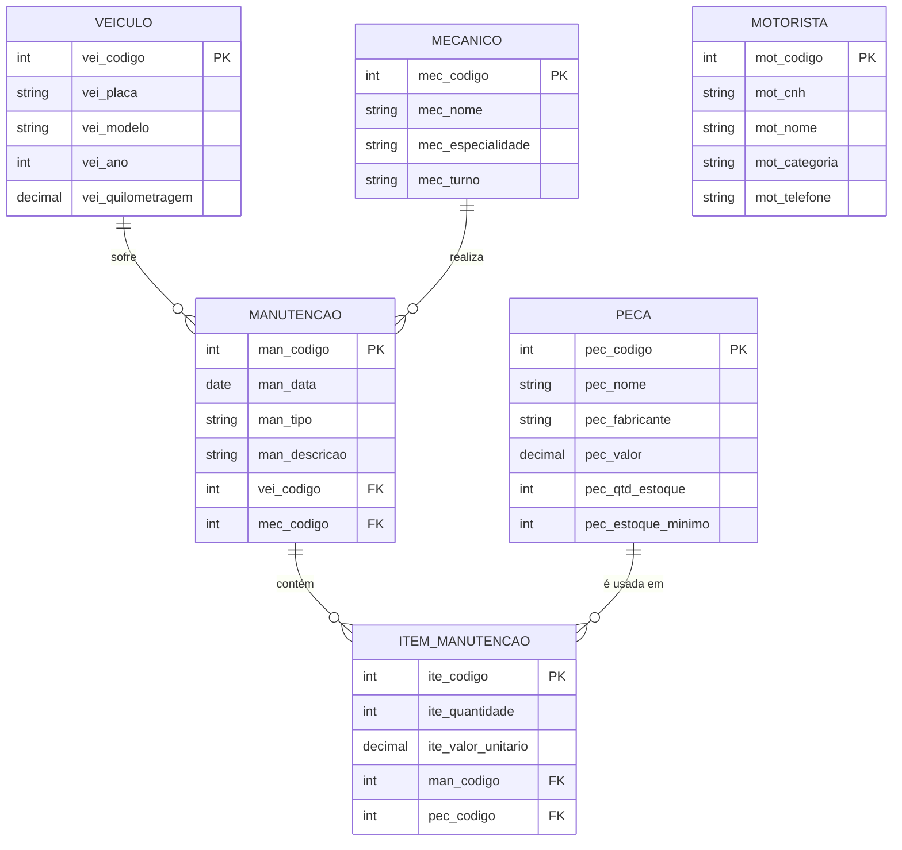
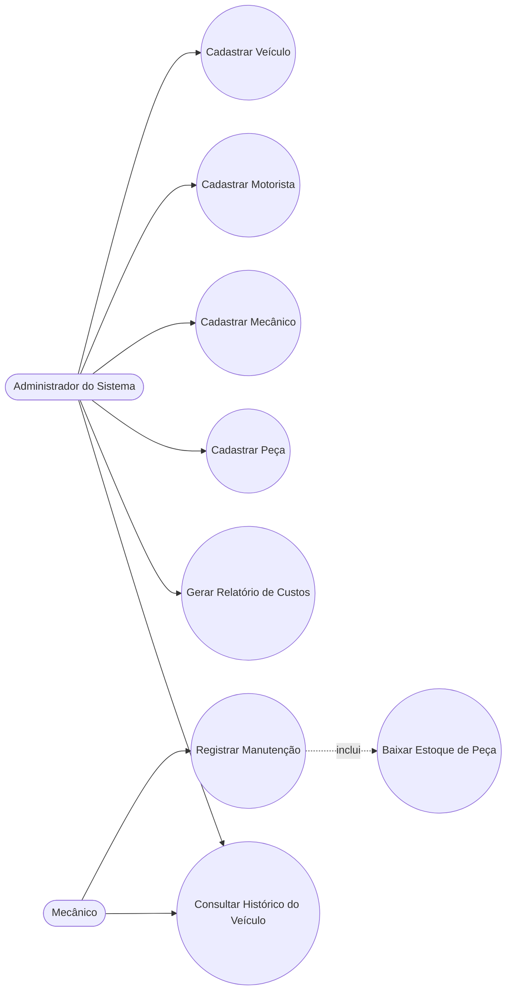

# Documentação Técnica — Sistema de Gestão de Frota e Manutenção Automotiva

Este documento reúne os entregáveis das Etapas 1, 2 e 4 da atividade prática
(modelagem, casos de uso e arquitetura). O script SQL da Etapa 3 está em
[`frota.sql`](frota.sql); as instruções de instalação e execução estão no
[`README.md`](README.md).

## Etapa 1 — Modelagem de Dados (MER)

### Entidades, chaves e atributos

O modelo contempla as 5 entidades pedidas — **Veículo, Motorista, Mecânico,
Manutenção e Peça** — mais a tabela associativa **Item_Manutenção**, criada
para resolver a cardinalidade N:M entre Manutenção e Peça.

> A entidade **Motorista** é mantida como cadastro independente, sem chave
> estrangeira, pois nenhum dos três relacionamentos mínimos exigidos pela
> atividade a envolve (o escopo do sistema é o controle de manutenções, não
> a escalação de motoristas por veículo).

### Relacionamentos exigidos (mínimo de 3) — como foram resolvidos

| Relacionamento | Cardinalidade | Resolução |
|---|---|---|
| Veículo → Manutenção | 1:N | FK `vei_codigo` em `TBL_MANUTENCAO` |
| Mecânico → Manutenção | 1:N | FK `mec_codigo` em `TBL_MANUTENCAO` |
| Manutenção ↔ Peça | N:M | Tabela associativa `TBL_ITEM_MANUTENCAO`, com FKs `man_codigo` e `pec_codigo`, mais os atributos próprios do relacionamento (`ite_quantidade`, `ite_valor_unitario`) |

O modelo lógico completo, com todas as PKs, FKs e restrições de integridade,
está implementado em [`frota.sql`](frota.sql) (Etapa 3) e replicado no ORM em
[`frota/models.py`](frota/models.py).

---

## Etapa 2 — Diagrama de Casos de Uso (UML)

### Atores
- **Administrador do Sistema** — realiza os cadastros, acompanha relatórios e
  gerencia o catálogo de peças.
- **Mecânico** — registra as manutenções que executa e consulta o histórico
  dos veículos atendidos.

### Diagrama

> Observação de notação: o Mermaid (motor de diagramas renderizado nativamente
> pelo GitHub) não possui um tipo de diagrama UML de Casos de Uso dedicado.
> A relação Ator → Caso de Uso abaixo é representada como um fluxograma
> (`flowchart`), com os casos de uso em nós arredondados, o que preserva a
> mesma informação de um diagrama de casos de uso tradicional.

### Descrição textual do caso de uso principal — Registrar Manutenção

| Campo | Descrição |
|---|---|
| **Ator principal** | Mecânico (ou Administrador) |
| **Objetivo** | Registrar uma manutenção preventiva ou corretiva executada em um veículo, incluindo as peças utilizadas |
| **Pré-condições** | Existir ao menos um Veículo, um Mecânico e uma Peça cadastrados no sistema |
| **Fluxo principal** | 1. O ator acessa "Manutenções → Registrar Manutenção". 2. Informa veículo, mecânico responsável, data, tipo (preventiva/corretiva) e descrição do serviço. 3. Adiciona uma ou mais peças utilizadas, informando a quantidade de cada uma (o valor unitário é preenchido automaticamente com o preço atual da peça, podendo ser ajustado). 4. Confirma o registro. 5. O sistema valida se há estoque suficiente de cada peça informada. 6. O sistema salva a manutenção e os itens, e **baixa automaticamente o estoque** das peças utilizadas (caso de uso incluído "Baixar Estoque de Peça"). |
| **Fluxos alternativos** | 3a. Se o estoque de alguma peça for insuficiente, o sistema exibe uma mensagem de erro por peça e não salva nada, mantendo o formulário preenchido para correção. 2a. Se algum campo obrigatório estiver ausente ou inválido (ex.: data futura), o sistema aponta o erro no respectivo campo. |
| **Pós-condições** | Uma nova Manutenção e seus Itens de Manutenção são persistidos; o estoque das peças utilizadas é reduzido; a manutenção passa a aparecer no histórico do veículo e nos relatórios |

---

## Etapa 4 — Arquitetura e Configuração do Framework

### Framework e padrão arquitetural

O projeto usa **Django** (Python), que segue o padrão **MVT — Model, View,
Template** (a variação do MVC usada pelo Django):

- **Model** (`frota/models.py`): define as 6 entidades do domínio (5 do
  enunciado + `ItemManutencao`), incluindo validadores de campo (placa, CNH,
  telefone, ano, valores não negativos) e propriedades calculadas (custo
  total, situação de estoque crítico).
- **View** (`frota/views.py`): contém a lógica de cada tela — Class-Based
  Views (`ListView`, `DetailView`, `CreateView`, `UpdateView`, `DeleteView`)
  para as quatro entidades simples, e views baseadas em função para
  Manutenção, que precisa orquestrar o formulário principal junto com o
  *formset* de itens (peças) e a baixa/devolução de estoque em uma
  transação atômica.
- **Template** (`frota/templates/frota/*.html`): a camada de apresentação,
  organizada em um `base.html` (menu lateral, topo, mensagens) estendido por
  todas as páginas, mais *partials* reutilizáveis para formulários genéricos
  e confirmação de exclusão.

### Mapeamento de rotas (URLs)

Rotas definidas em [`gestao_frota/urls.py`](gestao_frota/urls.py) (raiz) e
[`frota/urls.py`](frota/urls.py) (rotas do app):

| Recurso | Listar | Novo | Detalhe | Editar | Excluir |
|---|---|---|---|---|---|
| Veículo | `/veiculos/` | `/veiculos/novo/` | `/veiculos/<id>/` | `/veiculos/<id>/editar/` | `/veiculos/<id>/excluir/` |
| Motorista | `/motoristas/` | `/motoristas/novo/` | `/motoristas/<id>/` | `/motoristas/<id>/editar/` | `/motoristas/<id>/excluir/` |
| Mecânico | `/mecanicos/` | `/mecanicos/novo/` | `/mecanicos/<id>/` | `/mecanicos/<id>/editar/` | `/mecanicos/<id>/excluir/` |
| Peça | `/pecas/` | `/pecas/novo/` | `/pecas/<id>/` | `/pecas/<id>/editar/` | `/pecas/<id>/excluir/` |
| Manutenção (+ itens) | `/manutencoes/` | `/manutencoes/novo/` | `/manutencoes/<id>/` | `/manutencoes/<id>/editar/` | `/manutencoes/<id>/excluir/` |

Relatórios: `/relatorios/estoque/` e `/relatorios/historico/`.
Painel: `/` (dashboard com indicadores).
Admin do Django (bônus, fora do escopo pedido): `/admin/`.

### Templates base

`frota/templates/frota/base.html` define o esqueleto (menu lateral fixo,
barra superior, área de mensagens do Django `django.contrib.messages` e
rodapé) usado por todas as páginas via `` + ``.
Dois *partials* genéricos evitam duplicação de código:
`frota/templates/frota/partials/form.html` (formulário de criação/edição das
entidades simples) e `frota/templates/frota/partials/confirmar_exclusao.html`
(confirmação de exclusão, reutilizada por todas as entidades).

---

## Etapa 5 — CRUD

Para as 5 entidades e a tabela associativa, o sistema oferece:

- **Create**: formulários com validação de campo (`frota/forms.py`), com
  mensagens de erro específicas em português.
- **Read**: telas de listagem paginadas (10 por página) com busca simples, e
  uma tela de **visualização detalhada** por entidade (`.../<id>/`).
- **Update**: os mesmos formulários de cadastro, pré-preenchidos.
- **Delete**: tela de confirmação antes de excluir; exclusões que quebrariam
  a integridade referencial (ex.: excluir uma Peça já usada em alguma
  Manutenção) são bloqueadas com uma mensagem explicativa, em vez de gerar
  um erro do servidor.

A entidade associativa `ItemManutencao` não tem uma tela própria de CRUD —
ela é gerenciada dentro do formulário de Manutenção (criar/editar), como um
*formset* dinâmico ("+ Adicionar peça"), que é o padrão usual do Django para
relacionamentos N:M com atributos próprios.

## Etapa 6 — Relatórios

1. **Histórico do Veículo** (`/relatorios/historico/`): busca por placa e
   lista todas as manutenções e peças trocadas naquele veículo, com o custo
   total em peças.
2. **Estoque Crítico** (`/relatorios/estoque/`): lista as peças cuja
   quantidade em estoque está abaixo do estoque mínimo ideal cadastrado.

Ambos também aparecem resumidos no painel inicial (`/`).
